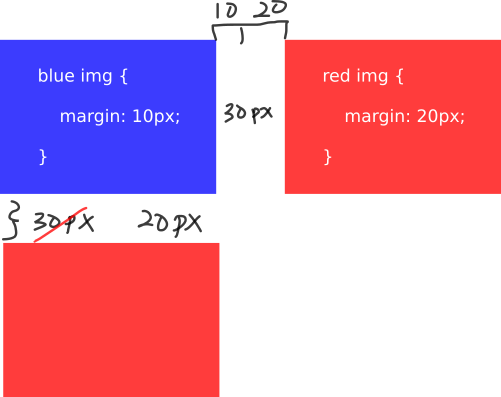

## Margin Collapse

블럭의 상단과 하단의 margin이 단 하나의 고정폭으로 합쳐질때가 있는데 이것을 **Margin Collapsing**이라고 부른다.   
참고로 floating과 absolute이 적용된 블럭들의 경우 절대 margin collapsing이 일어나지 않는다. 

아래의 이미지를 확인해보자.  

파란색 상자의 margin은 `10px`이고, 빨간 상자의 margin은 `20px`이다.
두 상자 사이의 가로폭은 `10px + 20px`로 총 `30px`이 된다.

그렇다면 세로폭 또한 `30px`일까? 그렇지 않다.
세로의 경우 가장 큰 margin을 고정폭으로 가져가 `30px`이 아닌 `20px`이 세로폭의 값이 된다.

Margin Collapsing이 일어나는 세 가지 경우가 있다.

- 자매들(siblings)끼리 인접한 경우
  * 위에서 설명한 예시가 여기에 속한다.
- 부모와 자식을 나누는 내용이 없을 경우
  * 부모와 자식 블럭의 margin-top과 margin-bottom을 따로 구별하는 내용이 아예 없을 경우, 부모와 자식의 두 margin-top 그리고 두 margin-bottom에 collapsing이 일어난다.
- 빈 블럭인 경우
  * padding, border, inline content, height, min-height, 등을 사용하지 않아 블럭의 `margin-top`을 `margin-bottom`과 분리할 수 없으면 collapsing이 일어난다.

## Box Dimension
  * Width of the box = `content width + padding-left/right + border-left/right`
  * Height of the box = `content height + padding-top/bottom + border-top/bottom`
  * Margin은 box dimension에 영향이 없다.
