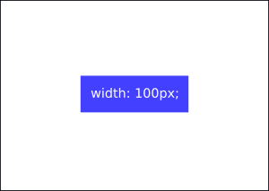

### Sprite Sheets

[Google 홈페이지 만들기](https://myoiwritescode.github.io/projects/google-homepage/)를 하면서 
아래와 같은 스프라이트 이미지를 사용했다. <br>

 <br>

위 이미지에서 원하는 아이콘을 사용하기 위해서는 해당 아이콘이 존재하는 좌표로 이동한 후,
아이콘의 크기(30x30)만큼 자르면 된다.

```css
object-fit: none;
object-position: -132px -37px;
width: 30px;
height: 30px;
```

`object-position`으로 어디서부터 30x30 크기의 이미지를 가져올지 정할 수 있다.<br>
여기서는 좌표(132, 37)에서부터 30x30 크기의 이미지를 가져온다. 


<hr>

### 가운데로 정렬
CSS에서 컨테이너를 중앙으로 정렬시키기 위해 아래와 같이 할 수 있다.

```css
margin: 0 auto;
```

그러면 페이지 중앙으로 정렬이 되야하는데 제대로 동작하지 않는데 이유는 width가 정의되지 않아서다.<br>


길이가 정의되지 않으면 자동으로 페이지 총 길이의 크기를 가지는데, <br>
이미 페이지와 동일한 길이의 크기를 가지고 있는 컨테이너를 중앙으로 정렬시킬 수 없다.

```css
width: 100px;
margin: 0 auto;
```



길이를 지정해 주었기 때문에 성공적으로 중앙에 정렬된다.
