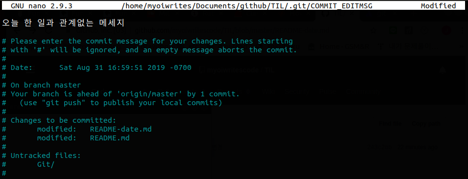

# Changing the last commit message

## --amend

```bash
git add .
git commit -m "오늘 한 일과 관계없는 메세지"
```

실수로 오탈자 또는 아예 내용을 잘못적어서 커밋 한 경우, `amend`를 이용해서<br>
마지막 커밋 메세지를 변경할 수 있다.

```bash
git commit --amend
```

위 명령어를 입력하면 아래와 같이 마지막 커밋 메세지를 고칠 수 있는 화면이 나온다.



메세지를 고친 후 저장하면 커밋이 변경된다.

에디터에서 따로 고치고 저장 할 필요없이 `-m` 옵션을 추가하면 콘솔에서 바로 수정이 가능하다.

```bash
git commit --amend "new message"
```

`git log -1`을 사용해 마지막 한 개의 커밋의 정보를 보여주는데 이를 통해서 커밋이 성공적으로 
변경 되었다는 걸 확인할 수 있다.


## --no-edit

두 개의 파일을 수정하고 나서 실수로 한 개의 파일만 커밋했을 경우,<br>
`--no-edit`옵션을 사용하면 두 개의 다른 커밋이 아닌, 하나의 커밋으로 push할 수 있다.

```bash
git add file1.rb 
git commit

git add file2.rb
git commit --amend --no-edit
```


